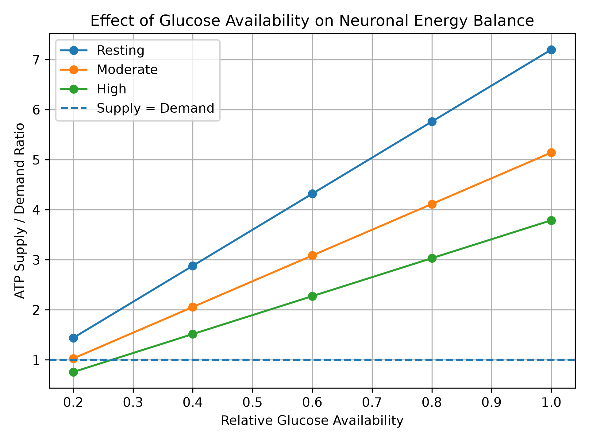
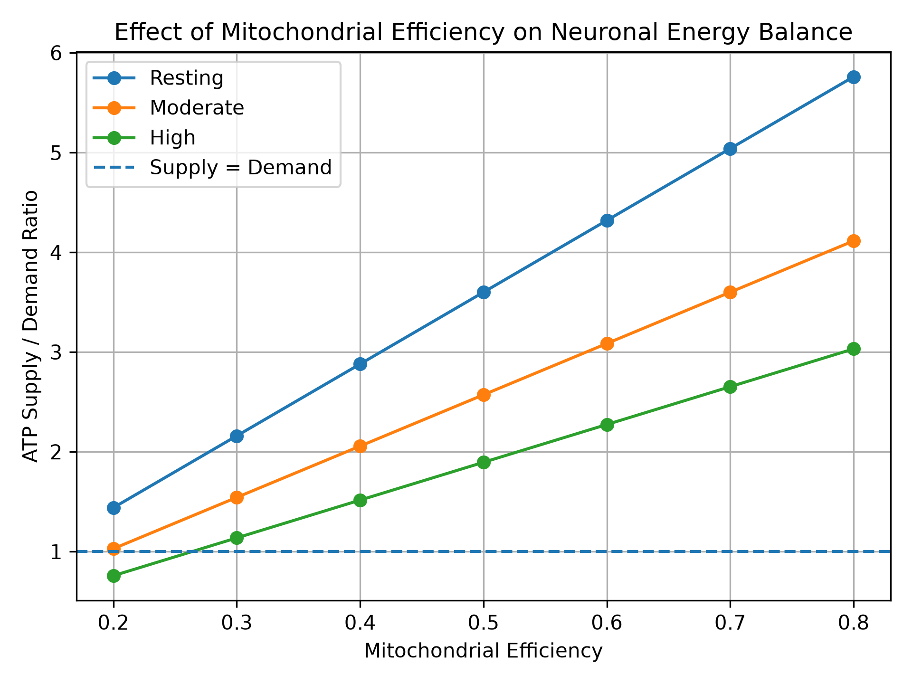
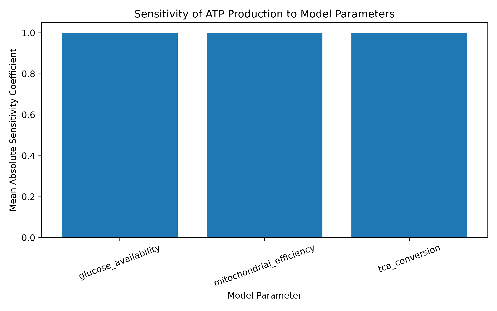

# A Python-Based Systems Biology Model of Neuronal Energy Metabolism and ATP Demand

## Project Overview

Neurons have high energetic requirements and depend strongly on mitochondrial ATP production to maintain processes such as ion homeostasis, membrane potential, neurotransmission, and synaptic activity.

This project develops a simplified Python-based systems biology model to explore how changes in glucose availability, neuronal ATP demand, and mitochondrial efficiency influence neuronal energy balance.

Rather than attempting to reproduce absolute intracellular ATP concentrations, the model focuses on the relationship between ATP production capacity and ATP demand under different metabolic and neuronal activity conditions.

## Research Question

How do changes in glucose availability, neuronal energy demand, and mitochondrial efficiency influence ATP production and neuronal energy balance?

## Personal Coonviction

My interest in neuronal metabolism developed from my previous research on neurochemical dysfunction and neuronal resilience. In my undergraduate thesis publication, I contributed to research investigating the effects of red onion husk extract on ketamine-induced manic-like behaviour and associated neurochemical alterations, including oxidative stress and antioxidant defence in the cerebral cortex and hippocampus. This work introduced me to the complex biochemical processes that maintain neuronal function and resilience.
Building on this experience, I became very interested in understanding neuronal function from a systems-level perspective, particularly how neurons balance energy production with changing energetic demands. Since maintaining neuronal activity requires a continuous supply of ATP, As a researcher with Biochemistry experience, I developed this project to explore computationally how glucose availability, mitochondrial efficiency, metabolic flux, and neuronal activity interact to influence cellular energy balance. The project also represents my transition from primarily experimental biochemistry toward computational and systems biology approaches for studying brain metabolism.

## Objectives

1. Develop a simplified computational model of neuronal energy metabolism.
2. Represent metabolic flux from glucose through glycolysis and the TCA cycle to oxidative phosphorylation.
3. Compare ATP production with ATP demand under different levels of neuronal activity.
4. Investigate the effect of reduced glucose availability on neuronal energy balance.
5. Perform mitochondrial-efficiency perturbation analysis.
6. Perform local sensitivity analysis on key model parameters.

## Model Architecture

The model represents the following simplified metabolic pathway:

```text
Glucose availability
        ↓
    Glycolysis
        ↓
     Pyruvate
        ↓
     TCA cycle
        ↓
   NADH + FADH2
        ↓
Oxidative phosphorylation
        ↓
  ATP production
        ↓
ATP supply / neuronal ATP demand
```

Three neuronal activity states are represented by different ATP-demand values:

| Activity state | Model ATP demand |
|---|---:|
| Resting | 50 |
| Moderate | 70 |
| High | 95 |

These values are model parameters used to represent relative differences in energetic demand and should not be interpreted as experimentally measured neuronal ATP consumption rates.

## Model Formulation

Glycolytic flux is represented as:

```text
Glycolysis rate = Glycolysis capacity × Glucose availability
```

Pyruvate production is assumed to follow glycolytic flux, after which a fraction enters the TCA cycle:

```text
TCA flux = Pyruvate production × TCA conversion
```

The simplified model represents TCA-derived reducing equivalents as:

```text
NADH production = TCA flux × 3
FADH2 production = TCA flux × 1
```

ATP production capacity is then estimated from oxidative phosphorylation:

```text
ATP production =
[(NADH × 2.5) + (FADH2 × 1.5)]
× Mitochondrial efficiency
```

Neuronal energy balance is evaluated using:

```text
ATP balance = ATP production - ATP demand
```

and:

```text
ATP supply/demand ratio = ATP production / ATP demand
```

A supply/demand ratio below 1 indicates that modeled ATP production capacity is insufficient to meet the specified ATP demand.

## Glucose Availability Simulation

Glucose availability was varied across five relative conditions:

```text
1.0, 0.8, 0.6, 0.4, 0.2
```

Each glucose condition was evaluated under resting, moderate, and high neuronal activity.

The simulation demonstrates that decreasing glucose availability progressively reduces ATP production capacity. The energetic effect becomes more important as neuronal ATP demand increases.

At the lowest simulated glucose availability (0.2), ATP production was 72 model units. This remained above resting demand (50) and slightly above moderate demand (70), but was below high neuronal demand (95).

For the high-activity condition:

```text
ATP supply/demand ratio = 72 / 95 ≈ 0.758
```

indicating an energy deficit in this model condition.



## Mitochondrial Efficiency Perturbation

A separate perturbation experiment examined how mitochondrial efficiency affects neuronal energy balance while glucose availability was held constant at 0.5.

Mitochondrial efficiency was varied from:

```text
0.2 to 0.8
```

Reduced mitochondrial efficiency decreased ATP production capacity across all neuronal activity states.

At mitochondrial efficiency = 0.2:

- Resting ATP supply/demand ratio = 1.44
- Moderate ATP supply/demand ratio ≈ 1.03
- High ATP supply/demand ratio ≈ 0.758

The high-activity state therefore crossed below the supply-demand threshold first as mitochondrial efficiency decreased.



## Sensitivity Analysis

A local sensitivity analysis was performed around the baseline parameter set:

```text
Glucose availability = 0.5
TCA conversion = 0.8
Mitochondrial efficiency = 0.5
```

Each parameter was independently increased and decreased by 10%.

The normalized local sensitivity coefficient was calculated as:

```text
Sensitivity =
(% change in ATP production) /
(% change in parameter)
```

All three parameters produced a sensitivity coefficient of approximately 1.0.



This result reflects the current multiplicative and linear structure of the model: a given percentage change in glucose availability, TCA conversion, or mitochondrial efficiency produces the same percentage change in predicted ATP production.

This is both a model result and an important model limitation. Incorporating nonlinear enzyme kinetics, substrate saturation, feedback regulation, mitochondrial respiratory constraints, and additional metabolic pathways could generate more complex parameter sensitivities.

## Key Findings

The model demonstrates three main behaviors:

1. Reduced glucose availability decreases modeled ATP production capacity.
2. Increasing neuronal energy demand increases vulnerability to an ATP supply-demand mismatch.
3. Reduced mitochondrial efficiency can produce an energetic deficit, particularly under high neuronal activity.

The local sensitivity analysis additionally demonstrates that glucose availability, TCA conversion, and mitochondrial efficiency currently have equal normalized influence on ATP production because of the simplified multiplicative structure of the model.

## Repository Structure

```text
brain_energy_metabolism/
│
├── model.py
├── perturbation.py
├── sensitivity.py
├── simulation_results.csv
│
├── results/
│   ├── glucose_activity_summary.csv
│   ├── mitochondrial_perturbation.csv
│   ├── sensitivity_analysis.csv
│   │
│   └── figures/
│       ├── atp_supply_demand.png
│       ├── mitochondrial_perturbation.png
│       └── sensitivity_analysis.png
│
└── README.md
```

## Running the Model

Clone the repository and install the required Python packages.

Run the main glucose/activity simulation:

```bash
python model.py
```

Run the mitochondrial perturbation analysis:

```bash
python perturbation.py
```

Run the local sensitivity analysis:

```bash
python sensitivity.py
```

The scripts generate CSV results and figures that are stored in the `results` directory.

## Model Assumptions and Limitations

This project is intended as a simplified conceptual systems-biology model rather than a quantitatively validated model of neuronal ATP metabolism.

Important assumptions include:

- Metabolic fluxes are represented using simplified proportional relationships.
- Glucose availability is expressed as a relative model parameter rather than an absolute concentration.
- ATP production and ATP demand are expressed in model units.
- ATP-demand values represent relative neuronal activity states rather than experimentally measured consumption rates.
- Glycolysis and TCA-cycle behavior are simplified.
- Feedback regulation and metabolite accumulation are not explicitly represented.
- Oxygen availability and transport processes are not explicitly modeled.
- Mitochondrial efficiency is represented by a single scaling parameter.
- The current model does not include astrocyte-neuron metabolic coupling.

Therefore, model outputs should be interpreted as qualitative and hypothesis-generating rather than direct physiological predictions.

## Future Directions

Future development could include nonlinear enzyme kinetics, oxygen dependence, mitochondrial respiratory capacity, lactate metabolism, astrocyte-neuron metabolic coupling, dynamic feedback regulation, and calibration against experimental or published metabolic data.

These extensions would allow the framework to move from a conceptual model toward a more mechanistically and quantitatively constrained model of brain energy metabolism.

## Technologies

- Python
- Pandas
- Matplotlib

## Author

K. N. Ugochukwu